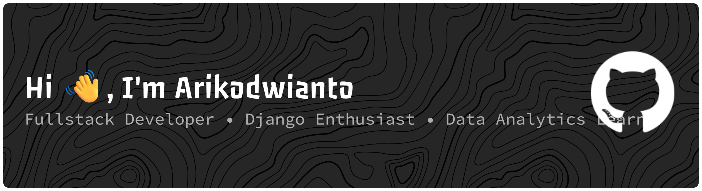

<h1 align="center">Hey , I'm Arikodwianto</h1>
<h3 align="center">Fullstack Developer • Django Enthusiast • Data Analytics Learner</h3>

  

  

---

# 🚀 About Me

✨ Passionate about building intelligent and impactful digital solutions  

 

<table align="center">
<tr border="none">
<td width="50%" align="left">

### 👨‍💻 Current Focus
- 📊 Learning **Data Analytics & Machine Learning**
- 🧠 Exploring **Artificial Intelligence & DSS**
- 🌐 Developing modern **Web Applications**
- ⚙️ Building scalable systems using **Django & Flask**

</td>

<td width="50%" align="left">

### 🛠️ Tech Interests
- 🐍 Python Ecosystem
- 💻 JavaScript Development
- 🗄️ MySQL & PostgreSQL
- 📈 Data Visualization & Analytics

</td>
</tr>
</table>

 

### ⚡ Fun Fact
> *“I enjoy turning ideas into useful and smart systems.”*

---

# 💻 Tech Stack

  

---

# 🛠️ Tools

  

---

# 📂 Featured Projects

### 🧠 Sistem Pendukung Keputusan Metode AHP

---

### 📊 Prediksi Kursus Menggunakan KNN

---

### 🏢 Sistem ERP & Kepegawaian Django

---

### 🛍️ Sistem Informasi Pengolahan Data Penjualan Di Toko Plastik GH Tanjungpinang

---

### 🌐 Website dan Dashboard Interaktif

---

---
# 🔥 GitHub Streak

  

---

# 🌐 Connect With Me

  

  

  

  
  

###

###
---
 

